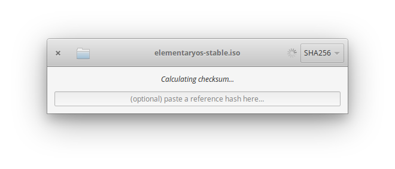

  <h1 align="center">Hash It</h1>
  <h3 align="center"> A simple app for checking usual checksums</h3>
  
Designed for <a href="https://elementary.io">elementary OS

### Donate
<a href="https://www.paypal.me/ArtemAnufrij">PayPal</a> | <a href="https://liberapay.com/Artem/donate">LiberaPay</a> | <a href="https://www.patreon.com/ArtemAnufrij">Patreon</a>

  

  

Supported algorithms:
* MD5
* SHA256
* SHA1
